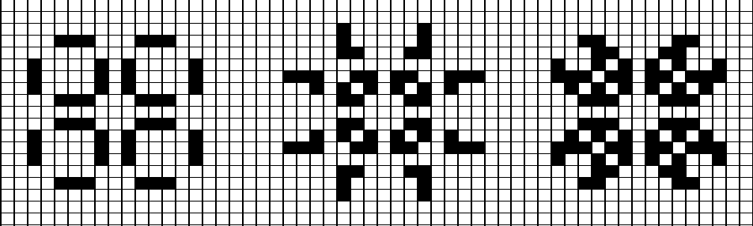
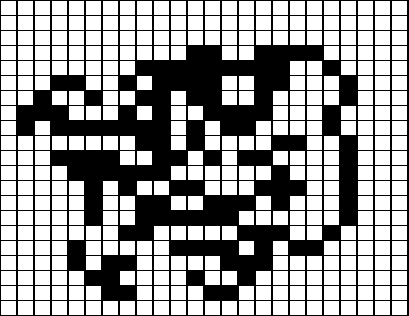

# Cellular Automata in different webapplications
## Overview
A cellular automaton (pl. cellular automata, abbrev. CA) is a discrete model of computation studied in automata theory. Cellular automata are also called cellular spaces, tessellation automata, homogeneous structures, cellular structures, tessellation structures, and iterative arrays. Cellular automata have found application in various areas, including physics, theoretical biology and microstructure modeling. [Wikipedia](https://en.wikipedia.org/wiki/Cellular_automaton#Overview)
## Game Of Life
### Overview
The Game of Life, also known simply as Life, is a cellular automaton devised by the British mathematician John Horton Conway in 1970. It is a zero-player game, meaning that its evolution is determined by its initial state, requiring no further input. One interacts with the Game of Life by creating an initial configuration and observing how it evolves. It is Turing complete and can simulate a universal constructor or any other Turing machine. [Wikipedia](https://en.wikipedia.org/wiki/Conway%27s_Game_of_Life)

### Rules
* Any live cell with fewer than two live neighbours dies, as if by underpopulation.
* Any live cell with two or three live neighbours lives on to the next generation.
* Any live cell with more than three live neighbours dies, as if by overpopulation.
* Any dead cell with exactly three live neighbours becomes a live cell, as if by reproduction.
### Implementation
#### WebSharper.UI
https://github.com/steiner2001/WebSharper_CellularAutomata/tree/master/GameOfLife_UI
#### WebSharper.MVU
https://github.com/steiner2001/WebSharper_CellularAutomata/tree/master/GameOfLife_MVU
#### Fable
https://github.com/steiner2001/WebSharper_CellularAutomata/tree/master/GameOfLife_Fable
## Langton's Ant
### Overview
Langton's ant is a two-dimensional universal Turing machine with a very simple set of rules but complex emergent behavior. It was invented by Chris Langton in 1986 and runs on a square lattice of black and white cells. The universality of Langton's ant was proven in 2000. The idea has been generalized in several different ways, such as turmites which add more colors and more states. [Wikipedia](https://en.wikipedia.org/wiki/Langton%27s_ant)

### Rules
* At a white square, turn 90° clockwise, flip the color of the square, move forward one unit
* At a black square, turn 90° counter-clockwise, flip the color of the square, move forward one unit
### Implementation
#### WebSharper.MVU
https://github.com/steiner2001/WebSharper_CellularAutomata/tree/master/LangtonsAnt_MVU
